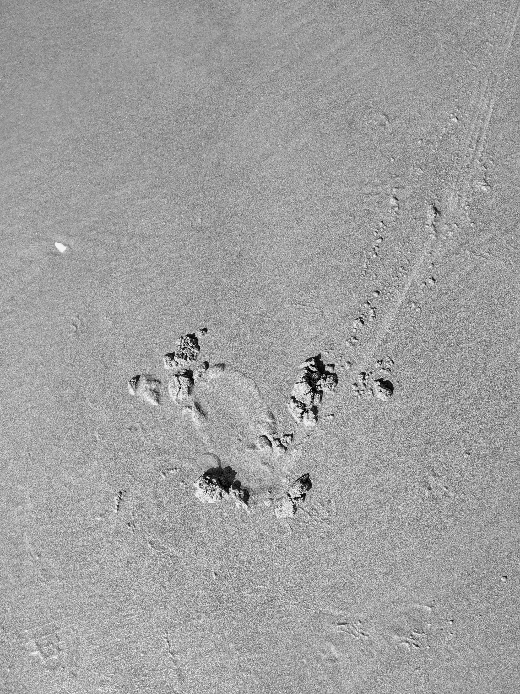

# JMSTONE MOMENTS
---
 ## Film Photography
 ---
#### 35MM
 ### Black & White
###### Palolo Valley, O'ahu, Hawai'i , 2019

![ ]
  ###### Folds, 2019
  ###### Endless Nights, 2019
  ###### It's a Busy Place, Go at a Steady Pace, 2018
  ###### Sorry For The Condesation, 2018
  
  ### Color
  ###### Small Town Blues, 2019
  ###### Sedona, Arizona, 2019
  ###### State of Mind, Arcosanti, Arizona, 2019

  #### 120MM 
  ### Black White
  ###### Smells Like Whiskey Row, Prescott, Arizona, 2019-2020
  ###### Dust & Dusk, Chino Valley, Arizona, 2019- 2020

____
## Digital Photography
---
 ###### Beach House, 2019
 ###### A study of sand a long the Oregon coast.

---

## Digital Imaging
---
###### Palinopsia, 2020
###### Ripe For Fire, 2020

----

----
# Beach House
A Study of Sand  onthe Oregon Coast

